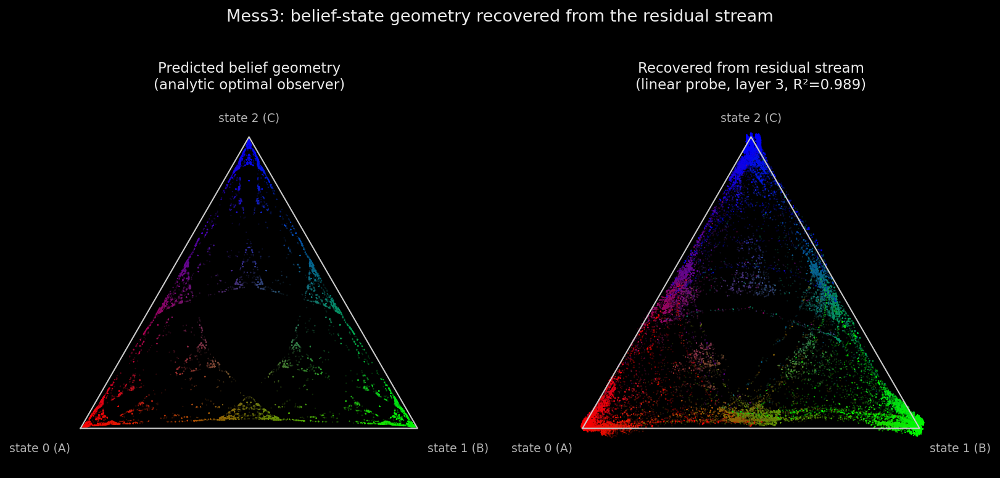

# Belief-State Geometry in a Transformer's Residual Stream

*A mechanistic-interpretability replication — recovering an HMM's Bayesian belief simplex, fractal and all, from a transformer's residual stream.*

A clean, from-scratch replication of the headline result of

> **Shai, A. S., Marzen, S. E., Teixeira, L., Gietelink Oldenziel, A., & Riechers, P. M. (2024).**
> *Transformers Represent Belief State Geometry in their Residual Stream.* NeurIPS 2024.
> [arXiv:2405.15943](https://arxiv.org/abs/2405.15943)

**The result in one sentence.** A small transformer trained *only* to predict the next
token of sequences from a known Hidden Markov Model develops, in its residual stream,
a **linearly decodable representation of the optimal Bayesian belief state** — the
distribution over the HMM's *hidden states* given the observed history — and that
representation matches a geometry (for the Mess3 process, an infinite **fractal**)
that is **predicted in advance** from the data-generating process.



*Left: the analytic Mess3 belief fractal (what an optimal Bayesian observer computes).
Right: the belief decoded by a single linear map from the 64-dimensional residual
stream of a transformer that never saw anything but next-token labels. Both are
coloured by the true belief (RGB = belief coordinates over the 3 hidden states).*

---

## Why this is a strong result (and easy to get subtly wrong)

The probe regresses residual activations onto the **belief over hidden states**, a point
in the probability simplex — **not** onto the next-token distribution. The next-token
distribution is *downstream* of the belief (a generally many-to-one function of it).
Regressing onto next-token probabilities would "replicate" the wrong thing. This
repository keeps the ground-truth belief (an exact Bayesian filter over hidden states)
strictly separate from anything the model outputs.

The geometry is **falsifiable and predicted beforehand**: for Mess3 (3 hidden states)
the reachable belief states form a specific fractal subset of a triangle, computed
analytically from the HMM — long before looking at a single activation.

## The result, quantitatively

<!-- RESULTS_TABLE_START -->
**Mess3 — the headline.** A 143k-parameter, 4-layer transformer (Adam, 10k steps, CPU).

| Metric | Value |
|---|---|
| **Linear probe R² (residual → belief), final layer** | **0.989** |
| Probe R² per layer (0 / 1 / 2 / 3) | 0.988 / 0.989 / 0.988 / 0.989 |
| Held-out next-token loss | 0.804 nats |
| Analytic optimal in-context loss (the floor) | 0.804 nats |
| Asymptotic entropy rate | 1.145 bits = 0.793 nats |

The model reaches the information-theoretic floor, and a single linear map recovers
the belief simplex coordinates from the residual stream with R² = 0.989 — the
fractal in the figure above is decoded, not imposed. Full numbers in
[`results/metrics_mess3.json`](results/metrics_mess3.json).

**RRXOR — distributed representation + information beyond the next token.**
(Light Ridge probe, `α=1`: the cumulative residual stream makes the across-layer
concatenation collinear, so plain OLS is numerically unstable there; the result
is robust for every `α ∈ [1, 1000]`. Mess3 uses plain OLS.)

| Metric | Value |
|---|---|
| Probe R² per layer (0 / 1 / 2 / 3) | 0.40 / 0.47 / 0.55 / 0.61 |
| **Probe R² from concatenated layers** | **0.82** (≫ any single layer) |
| R² residual → belief | 0.82 |
| R² next-token distribution → belief | 0.27 |

The belief geometry is **distributed across layers** (the concatenation recovers
far more than the best single layer, 0.82 vs 0.61), and the residual stream
encodes the belief **far better than the next-token distribution can** (0.82 vs
0.27) — i.e. it carries information about the whole future, not just the next
token the model was trained on. Full numbers in
[`results/metrics_rrxor.json`](results/metrics_rrxor.json).
<!-- RESULTS_TABLE_END -->

## Quickstart

```bash
# 1. Reproducible environment (Python 3.11, pinned via uv.lock)
uv sync

# 2. Unit tests for the HMMs and the belief math (no ML)
uv run pytest

# 3. (Optional) retrain the tiny models on CPU — committed checkpoints already exist.
#    Mess3 ~8 min; RRXOR needs more steps to crystallise its distributed representation.
uv run python src/train.py --process mess3 --preset fast --steps 10000
uv run python src/train.py --process rrxor --preset fast --steps 50000

# 4. Reproduce the figures + metrics.json (loads the committed checkpoints instantly)
uv run jupyter lab   # then run notebooks/01_mess3_replication.ipynb and 02_rrxor_layers.ipynb
```

Everything runs on CPU or a consumer laptop GPU — these are tiny models
(~143k parameters) on toy data. No datasets are downloaded; all sequences are
generated from the HMMs in this repo.

## How it works (the pipeline)

1. **Pick a tiny HMM with known structure** — Mess3, then RRXOR (`src/hmms/`).
2. **Compute the belief geometry analytically** — the *prediction*. The reachable
   belief set (Mixed-State Presentation) is enumerated exactly for finite processes
   and sampled for the infinite Mess3 fractal (`src/beliefs.py`).
3. **Sample token sequences** from the HMM (`src/data.py`).
4. **Train** a small transformer on next-token prediction (`src/train.py`); loss
   converges to the analytic entropy-rate floor.
5. **Cache the residual stream** at every position (`blocks.{l}.hook_resid_post`).
6. **Linearly regress** activations → analytic belief coordinates and report R²
   on held-out data (`src/probe.py`).
7. **Project & plot** against the predicted geometry (`src/viz.py`).

## Faithfulness to the paper

Architecture and process definitions match the paper exactly (verified against
Appendix A of [arXiv:2405.15943](https://arxiv.org/abs/2405.15943)):

| Item | Value | Source |
|---|---|---|
| Mess3 parameters | `x = 0.05`, `α = 0.85` | App. A.1 (recovered from the printed `T^(A)`) |
| RRXOR | 5 hidden states, 36 belief states, binary alphabet | App. A.1 |
| Architecture | 4 layers, `d_model=64`, 1 head, `d_head=8`, `d_mlp=256`, `n_ctx=10` | App. A.4 |
| Normalisation / activation | LayerNorm / ReLU, causal attention | App. A.4 |
| Residual stream | 64-dimensional (probe maps 64 → 3) | App. A.4 |

> **Note on a common mistake:** a popular community default for Mess3 is
> `x=0.15, α=0.6` (the default in the authors' `epsilon-transformers` library).
> That is **not** the value used for the paper's figures — `tests/test_hmms.py`
> pins our Mess3 to the paper's exact `T^(A)` so this can't silently drift.

**Documented deviation.** The paper trains with SGD (lr 0.01) for 1,000,000 steps.
For a laptop-friendly run the default here uses Adam with a larger batch for far
fewer steps, reaching the *same* information-theoretic loss floor. Belief recovery
is a property of the converged model, not of the optimiser — the paper-faithful
recipe is available via `TrainConfig.paper()` and `--preset paper`. Positional
encoding (unspecified in the paper) is TransformerLens's standard learned absolute
embedding.

## Repository layout

```
belief-state-geometry/
  src/
    hmms/            # data-generating processes (Process ABC + Mess3, RRXOR, Mixture)
    beliefs.py       # analytic belief states, MSP enumeration/sampling, entropy rate, simplex projection
    data.py          # sequence sampling, batching, held-out eval sets, seeding/device
    model.py         # HookedTransformer config matching the paper
    train.py         # training loop, loss-vs-entropy-rate logging, checkpointing (CLI)
    probe.py         # linear regression resid -> belief, R², simplex projection
    viz.py           # fractal + activation-cloud plots; per-layer panels
    experiments.py   # end-to-end orchestration -> figures + metrics.json
  notebooks/         # 01_mess3_replication.ipynb, 02_rrxor_layers.ipynb
  tests/             # pytest: HMM matrices, stationary dist, belief update, MSP, entropy rate
  results/           # saved figures + metrics_*.json
```

## Secondary results (RRXOR)

- **Distributed across layers.** Unlike Mess3 (recoverable from the final residual
  stream), RRXOR's belief geometry is best recovered from the **concatenation of
  residuals across all layers** — see `02_rrxor_layers.ipynb`.
- **Information beyond the next token.** The residual stream linearly encodes the
  belief, which carries information about the *entire future* — strictly more than
  the next-token distribution the model was trained on (which is a lossy function of
  the belief). Quantified in `results/metrics_rrxor.json`.

## Phase 2 — mixture processes: does the residual hold *only* what it needs?

Phase 1 shows the residual stream *contains* the belief state. Phase 2 asks whether it
contains **only** the minimal sufficient statistic, or more. A **mixture process**
(`src/hmms/mixture.py`) flips a hidden fair coin `Z` each epoch, choosing one of two
sub-generators that are statistically identical for `i` steps and then diverge; `Z` is
resampled every epoch. Once an epoch ends, `Z` is **predictively defunct** — a minimal
predictor would discard it.

**Result: the model is "super-sufficient."** It keeps the defunct coin linearly
decodable at ~100% well into the next epoch, where the optimal belief has provably
dropped it — the residual carries the belief state **plus** predictively-irrelevant
memory (it is *finer-grained than the causal state*), while still predicting optimally
(loss at the in-context floor). Established with controls:

- **Robust** — retention ≈ 1.0 across horizons `i ∈ {1,2,5,10,20}` × 3 seeds, all at the
  loss floor, with decodability onset tracking the horizon exactly
  ([`results/mixture_retention_vs_horizon.png`](results/mixture_retention_vs_horizon.png)).
- **Causally inert, not silently used** — ablating the coin's direction in epoch 2 drives
  its decodability 1.0 → 0.50 yet leaves next-token loss unchanged, while the *same*
  ablation where the coin **is** used spikes the loss
  ([`results/mixture_ablation.png`](results/mixture_ablation.png)).
- **Retention is load-dependent** — with a *single* spent coin in context, shrinking the
  residual width induces no forgetting (it stays re-readable;
  [`mixture_capacity_pressure.png`](results/mixture_capacity_pressure.png)). But over a
  6-epoch context a full-width model holds a near-complete **ledger** of all five past
  coins, while a narrow model (`d_model=8`) sheds the **oldest** first and protects the
  live one — the first forgetting in this study
  ([`retention_ledger_w8.png`](results/retention_ledger_w8.png)). So the model keeps
  useless latents *when it can afford to*, and moves toward minimality under
  representational load.

The mixture is just another `Process` and "which generator" is just another probe
target, so this reuses the Phase-1 abstractions unchanged. Full method, geometry, and
caveats: [`docs/phase2.md`](docs/phase2.md). Reproduce via the
`experiments.run_mixture_*` / `causal_ablation` / `capacity_pressure_sweep` functions.

## Side experiment — the norm is not a confidence channel

Belief content is *directional*; does the residual's L2 **norm** carry the model's
*uncertainty*? Within-position correlations against the analytic entropies say no.
Mess3 shows a moderate norm–confidence correlation, but its belief- and next-token
entropies are rank-identical (ρ = 0.999), so it cannot say which one the norm tracks.
RRXOR pulls them apart (ρ = −0.07) and is decisive: the final-layer norm tracks
**next-token (output) entropy** (mean ρ ≈ +0.68; 0.86–0.92 at mid positions) while the
correlation with **belief** entropy stays ≈ 0 at every layer. Consistent with the
LayerNorm null — every reader of the stream normalises scale away — so uncertainty,
like content, lives in direction
([`results/norm_confidence_rrxor.png`](results/norm_confidence_rrxor.png),
[`results/metrics_norm_confidence.json`](results/metrics_norm_confidence.json)).

## References

- Shai, Marzen, Teixeira, Gietelink Oldenziel, Riechers (2024). *Transformers Represent
  Belief State Geometry in their Residual Stream.* [arXiv:2405.15943](https://arxiv.org/abs/2405.15943).
- The authors' plain-language writeup on the AlignmentForum/LessWrong.
- [TransformerLens](https://github.com/TransformerLensOrg/TransformerLens) (residual-stream hooks).
- Marzen & Crutchfield — computational-mechanics origins of Mess3 and the Mixed-State Presentation.

*This is an independent, from-scratch implementation built as a portfolio artifact.
Community replications exist and were consulted only when stuck; none were copied.*
