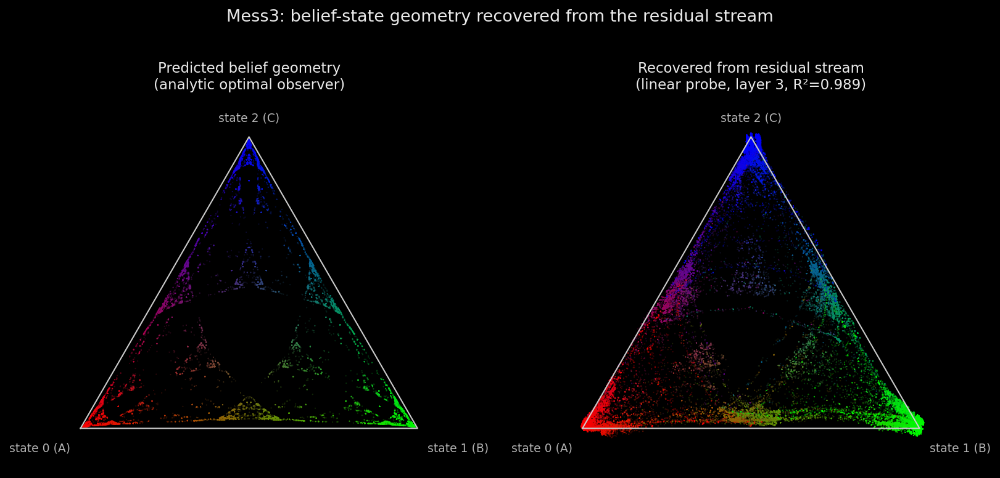
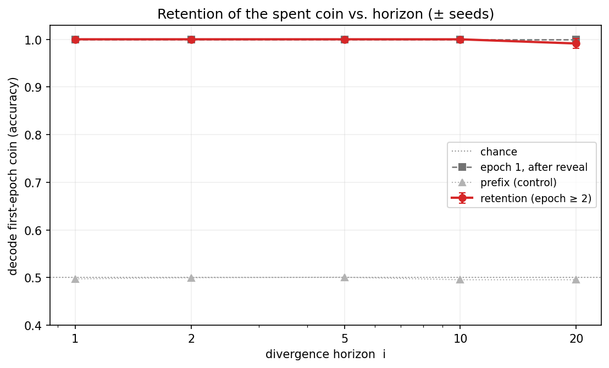
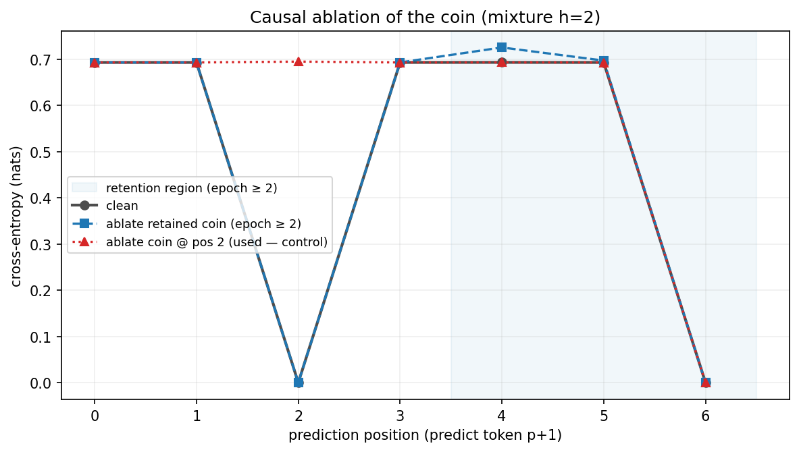
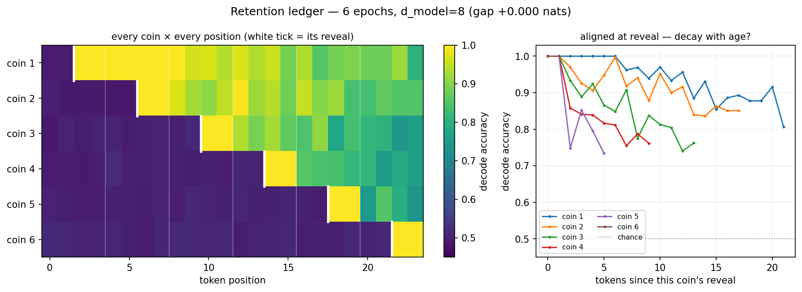

# Transformers keep belief states they no longer need — until capacity forces them to forget

*A from-scratch replication of [Shai et al. (2024)](https://arxiv.org/abs/2405.15943),
extended with a mixture-process experiment on what the residual stream keeps and discards.
Code, tests, and figures: [github.com/LGOICOUR/belief-state-geometry](https://github.com/LGOICOUR/belief-state-geometry).*

> *AI summary — a Claude-drafted overview of this project. For the author's own writeup, as published to LessWrong, see [`lesswrong-writeup.md`](lesswrong-writeup.md).*

## Summary

- I replicate the belief-state-geometry result: a small transformer trained *only* on
  next-token prediction over a known HMM linearly encodes the optimal Bayesian belief over
  the generator's hidden states, in the geometry predicted from the process alone (for the
  Mess3 process, a fractal; R² ≈ 0.99 from the final residual stream).
- That belief state is the **minimal sufficient statistic** for prediction. I test whether
  the residual holds *only* that. It doesn't: when a latent variable becomes predictively
  irrelevant, the model keeps it linearly decodable at ~100% anyway — it retains more than
  it needs.
- A **causal ablation** shows the retained information is **inert**: removing it changes no
  prediction, while removing the same information where it *is* used breaks the prediction.
  So it is genuinely unused, not silent computation.
- The surplus is discarded only under **capacity pressure**: a full-width residual stream
  holds a *ledger* of many stale latents at once; a narrow one sheds the **oldest** first
  while protecting the live one — an empirical traversal of the predictive rate–distortion
  trade-off.

None of these phenomena is individually surprising. The contribution is a clean,
ground-truthed, causally-checked demonstration of all four in one toy system where the
optimal representation is computable in closed form.

## Background: belief-state geometry

Computational mechanics answers "what must an optimal predictor represent?" precisely: to
predict a process as well as possible, a system must track the **minimal sufficient
statistic of the past for the future** — the *belief state*, a distribution over the
generator's hidden states (its equivalence classes are the *causal states*). [Shai et al.
(2024)](https://arxiv.org/abs/2405.15943) showed transformers do exactly this: the belief
state appears, linearly, in the residual stream, in the geometry derived from the process
*before* looking at the network.

I reproduce this from scratch. For **Mess3**, the reachable belief states form a fractal in
the 2-simplex; a single linear probe recovers it from the 64-dimensional final-layer
residual at **R² ≈ 0.99**, matching the analytic fractal:

(For RRXOR I also reproduce the secondary results — the belief is distributed across layers,
and the residual encodes it far better than the next-token distribution can. Details in the
repo.) Training loss sits at the analytic entropy-rate floor throughout, which is what makes
the representational claim non-vacuous: an optimal predictor *must* carry the sufficient
statistic.

## The question

The belief state is *minimal* by definition — everything relevant to the future, nothing
else. So a sharp test of how literally to read "the transformer represents the belief
geometry" is: does the residual hold **only** that, or does it carry extra,
predictively-irrelevant information? Cross-entropy training has no term that forbids the
latter.

## Setup: a mixture with a tunable divergence horizon

I build a process where the question has a closed-form answer. Each **epoch**, a fair hidden
coin `Z ∈ {A, B}` selects one of two sub-generators. The two are **statistically identical
for the first `i` steps** (a shared random prefix), then **diverge** (a short
`Z`-indicator tail). `Z` is resampled every epoch. So `Z` is unidentifiable until the
divergence, and — because it is resampled — once an epoch ends, `Z` is **predictively
defunct**: nothing in the future depends on it. The horizon `i` is a dial.

This is just another process in the same framework; "which generator is active" is a
marginal of the belief, so the same analytic-belief and linear-probe tools apply. I decode
`Z` by position from the residual stream.

## 1. The model keeps the stale latent

Within an epoch the model behaves as theory demands: `Z` is at chance before the divergence
and commits to ~1.0 exactly at the horizon. The interesting part is the **next** epoch. Once
an epoch ends, the optimal belief about the just-finished coin is `½` — yet the model keeps
the old coin **decodable at ~100%** well into the following epoch, where the current tokens
are provably independent of it. The residual state is therefore *finer-grained than the
causal state*: it preserves a distinction the minimal sufficient statistic discards.

It's robust: across horizons `i ∈ {1, 2, 5, 10, 20}` and three seeds each — every model
trained to the loss floor — retention is ≈ 1.0 (1.00 for `i ≤ 10`, 0.99 at `i = 20`), and
the onset tracks the horizon exactly.

## 2. ...and the retained information is causally inert

Decodability is not use — a linear probe can read information the computation ignores. So I
ablate it: project the coin's direction out of the residual where the coin is defunct, and
measure next-token loss, with a positive control.

- **Ablate the defunct coin** (next epoch): its decodability collapses 1.0 → 0.50, yet
  next-token loss is **unchanged** (max Δ ≈ 0.03 nats).
- **Ablate the same coin where it is used** (at the reveal, to predict the next indicator):
  that prediction's loss **spikes** 0.0 → 0.69 nats.

So the retained copy is decodable *and demonstrably unused*. The control matters: without
it, "ablating it does nothing" could just mean a dull knife.

## 3. ...but it is discarded under capacity pressure

Does the model ever become minimal? Shrinking the residual width alone does not force
forgetting — with a single defunct coin in a two-epoch window, retention stays ~1.0 at every
width that still learns the task (the coin remains re-readable from context). So I raise the
load: a **six-epoch** context, decoding *every* coin at every position — a retention ledger —
at two widths.

At full width the model holds a near-complete ledger: all five past coins decodable
(0.82–1.0), plus the live one at 1.0. At `d_model = 8`, the same model — still at the loss
floor — **sheds the oldest coins first** while keeping the live coin at 1.0:

This is the first forgetting in the project, induced by representational **load × age**, not
width alone. It is what [predictive rate–distortion](https://arxiv.org/abs/1412.2859)
predicts: *under resource constraints, the optimal lossy representation is the minimal
sufficient statistic.* Full capacity → keep everything reachable; scarce capacity under load
→ move toward minimality, discarding the most useless (oldest) information first. The model
sheds precisely what the rate–distortion bound says it should.

## Related work

This sits downstream of [Shai et al. (2024)](https://arxiv.org/abs/2405.15943), which I
replicate. A sibling follow-up, [Piotrowski et al. (2025)](https://www.lesswrong.com/posts/BRiQ6Mn5HKc5SoyY3/constrained-belief-updates-and-geometric-structures-in),
studies how RRXOR's belief geometry is shaped by architectural constraints — a different
question (no mixtures, retention, or interventions). That trained models linearly encode
latent state beyond their immediate output is well established (world-model probes; the
[identifiability result](https://arxiv.org/abs/2503.08980) that representations are a linear
transform of the log-posterior over latents). The discipline that *decodability ≠ use*, and
the directional ablation I use, come from amnesic probing / concept erasure
([LEACE](https://arxiv.org/abs/2306.03819)). And the capacity result is an empirical instance
of the information-bottleneck / [predictive rate–distortion](https://arxiv.org/abs/1412.2859)
view. So none of the ingredients is new; the contribution is putting them together —
over-retention, its causal inertness, and its capacity-dependent collapse — in one
ground-truthed toy system.

## Limitations and what's next

- **Toy process, known generator.** This is a proof of principle where the optimal
  representation is computable; not yet a claim about frontier models.
- **In-context reachability is a confound for "memory."** The defunct coin's tokens remain
  in the context window, so the model forgets under *load*, not because the information became
  inaccessible. The clean isolation is the **next experiment**: push the latent out of the
  context window, or use a recurrent / state-space model where state must be *carried*, and
  ask whether an optimal predictor then compresses the spent latent away.
- **Scale.** Small models, toy data, a single architecture; probes are linear and evaluated
  held-out.

## On method

I directed this project — the questions, the experimental decisions, and the framing — and
built it in close collaboration with Claude (Claude Code), which wrote most of the
implementation and a first draft of this post. All results are reproducible from the
committed code, and the commit history records the collaboration.

## Reproducibility

From scratch (NumPy + PyTorch + TransformerLens), unit-tested (the HMMs, beliefs, and
analytic predictions), and reproducible on CPU or a consumer GPU — the tiny checkpoints are
committed so the figures regenerate without retraining. Method and full caveats:
[`docs/phase2.md`](phase2.md). Repo:
[github.com/LGOICOUR/belief-state-geometry](https://github.com/LGOICOUR/belief-state-geometry).
