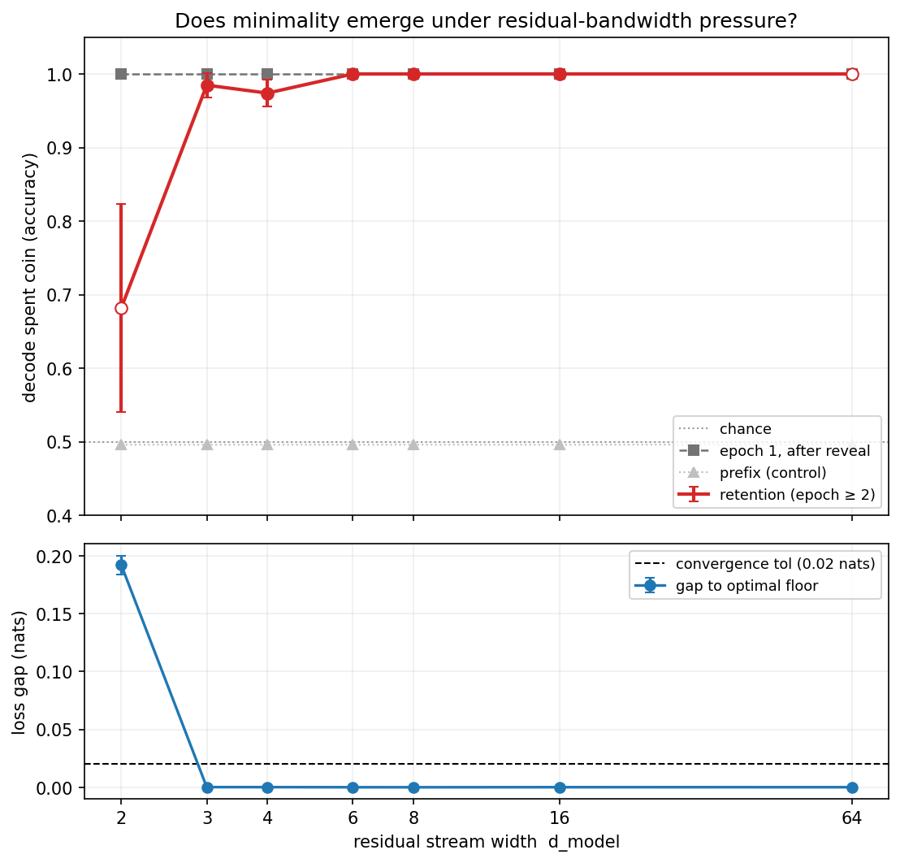

# Toy transformers may represent belief-state geometry optimally but not minimally

*Published on [LessWrong](https://www.lesswrong.com/posts/vzav5kfbRCDQyEB8v/toy-transformers-may-represent-belief-state-geometry).*

> *Methods note: The code used for the experiments and related [open-source repo](https://github.com/LGOICOUR/belief-state-geometry) were built with Claude. The experimental design and writeup is my own, with minimal editing and formatting amendments made with Claude.*

## Thesis

A toy transformer keeps provably predictively defunct belief state data in its residual stream. This information is shed only when there is a sufficient amount of imposed capacity pressure, in which case the oldest predictively defunct information is shed first.

## Results

I conducted a set of experiments that served as extensions of the results presented in [Shai et al. 2024](https://arxiv.org/abs/2405.15943).

The original publication uses Hidden Markov Models (HMMs) to train toy transformers on next token prediction, and then uses values in the residual stream to generate Bayesian belief state representation about the HMMs upon which it was trained. Optimal-prediction theory, the proposition that a system is likely to use the most energetically inexpensive ("optimal") method to represent the requisite information for next token prediction, is a meaningful top-down framework for this experiment because it fits neatly with the results of the experiment: referencing representations of the predictively significant state information of the HMMs is less energetically demanding than, say, referencing a lookup table for any given string of tokens (in other words, bringing a single inefficient predictive system to bear on every HMM agnostic to differences in the states and algorithms that differentiate those HMMs).

As such, my hypothesis was as follows: according to optimal-prediction theory, a transformer should recognize and prune away information irrelevant to next token prediction. Therefore, were we to introduce a stochastic token generation element (a "coin") that affects state meaningfully for certain epochs, but then becomes irrelevant or redundant, we would expect the transformer to prune away data about the coin. However, the first experiment immediately disproved the initial hypothesis: information about the coin was preserved in the residual stream of the transformer long after it was defunct.

This naturally raised two further questions: was the information about the coin preserved in the residual stream provably insignificant to prediction, and does the system recognize the predictive relevance (or lack thereof) of data about the coin? The first question was straightforward to answer: when I deliberately ablated information about the coin from the residual stream directly (a diff-in-means directional ablation — a lightweight form of concept erasure in the [amnesic-probing](https://arxiv.org/abs/2006.00995) / [LEACE](https://arxiv.org/abs/2306.03819) family), I found that there was no change in its predictive accuracy, suggesting that the information about the coin was inert, or predictively insignificant. Importantly, ablating the coin when it's still predictively relevant spikes the loss, proving the predictive significance of the coin and the reliability of the ablation technique.

For the next question, I chose to take inspiration from the foundational work characterizing the "curse of dimensionality" in predictive rate–distortion analysis ([Marzen & Crutchfield, *Circumventing the Curse of Dimensionality in Prediction*](https://arxiv.org/abs/1412.2859)) — past information is theoretically useful for future token prediction, but can become unfeasible when the required resources to hold onto past information exceed what is practical. I therefore decided to provide limitations to its ability to preserve the information about the coin, effectively putting the transformer in a state wherein it would have to selectively prune information it deemed relatively predictively insignificant. In other words — can we pressure the transformer into forgetting information about the coin? The answer was yes, though not how I expected. I hypothesized that limiting the width of the residual stream would limit the information it could represent, and it would therefore prune information about the coin after it was deemed insignificant. This was not the case — narrowing the residual stream alone did not cause the transformer to drop information about the coin. This is likely because the attention layer is able to re-derive the information about the coin from its presence in the context window. This means that a simple narrowing doesn't serve as a true memory bottleneck.

However, after training transformers with variable residual stream widths on many coins over six epochs, I found that the narrower models preferentially discarded older information about the coin. In other words, the transformer was sufficiently pressured to drop predictively insignificant information following narrowing the residual stream, but used age as the discernible factor for "forgetting," not significance alone. Under residual stream narrowing and multiple competing defunct coins, the transformer will preferentially discard the older coins.

This does not necessarily meaningfully refute optimal prediction theory, but it adds a slight caveat. Transformers may represent data consistent with converging on optimal predictors, but they do so without requiring [representational minimality](https://arxiv.org/abs/1412.2859). Future directions for this work continue to push the distinction between optimal prediction and representational minimality. For example, in order to truly apply memory pressure to the transformer and remove the attention layer's ability to re-derive the information about the coin, using a state-space model where the state cannot be re-read by the attention layer but must instead be carried forward from layer to layer would force the transformer to use memory to retain information about the coin.
