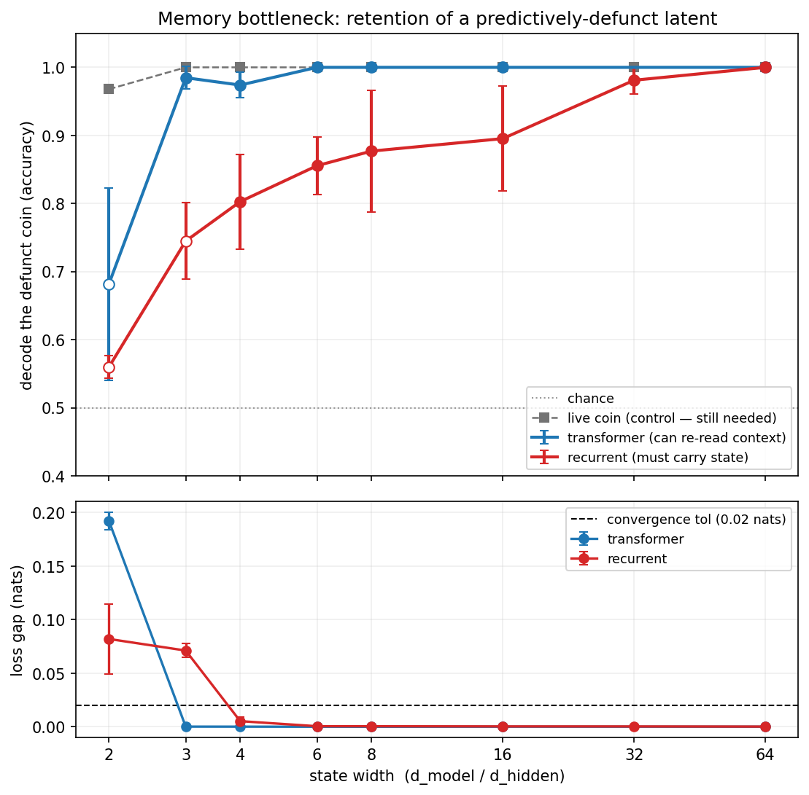

# Phase 3 — the memory bottleneck: does an optimal predictor carry what it no longer needs?

## The question Phase 2 left open

Phase 2 showed a transformer keeps a predictively-defunct latent (the mixture coin)
linearly decodable at ~100% after it stops mattering — *super-sufficiency*. But there is a
confound baked into the architecture: the coin's indicator tokens stay inside the context
window, so attention can simply **re-read** them. Nothing has to survive a memory
bottleneck. The load-dependent forgetting of the retention ledger is real, but the
information is always in-principle re-readable.

So Phase 2 tests a transformer-specific claim, not a claim about optimal predictors in
general. Phase 3 removes the crutch.

## The bottleneck

Swap the transformer for a **recurrent model** (a GRU here; a state-space model in Phase 4). A
recurrent model has no attention: at position `t` it sees only the current token plus a
**fixed-size carried state** `h_t ∈ ℝ^{d_hidden}`. Anything from the past it wants at
position `t` must have been actively stored in `h_t`. Retaining the defunct coin now
**costs hidden-state dimensions** — so, unlike the transformer, an optimal recurrent
predictor has a reason to compress it away.

This is the clean form of the minimality question. Computational mechanics predicts the
minimal carried state is exactly the causal-state set (the ε-machine); a bottlenecked
optimal predictor should converge toward it.

## Prediction (informative either way)

- **Transformer (Phase 2):** retains the single defunct coin at *every* residual width —
  the capacity sweep proved width alone doesn't induce forgetting, because it re-reads.
- **Recurrent (Phase 3):** must carry the coin in `h_t`. Prediction: below some `d_hidden`
  threshold the GRU **drops** the defunct coin (minimality via *inaccessibility*, not load)
  while still tracking the live belief.
- **Headline:** retention-of-defunct-coin vs. `d_hidden`, showing a drop the transformer
  never shows. If it *doesn't* drop — super-sufficiency is architecture-general — that is
  also a real result.

## What we measure

1. **The bottleneck curve** — retention(defunct coin) vs. `d_hidden` on the mixture (headline),
   decoded from `h_t` by position exactly as Phase 2 decoded it from `resid_post`.
2. **The contrast** — transformer (re-reads, retains at all widths) vs. recurrent (carries,
   drops as the state tightens), same process, same probe.
3. **Two controls** — convergence to the loss floor (a drop only counts as minimality where
   the task was still learned) and the **live coin** (information the model provably needs,
   so its survival rules out "the small model is simply broken").

Deferred to Phase 4 (see below): the causal ablation on `h_t`, and a full belief-geometry
probe of the carried state. Phase 3 decodes the *generator marginal* (the coin), not the
whole belief simplex, so "belief geometry appears in a recurrent state" is **not** claimed here.

## Results (P0–P3 complete)

**P0 — the GRU is an optimal predictor.** At `d_hidden = 64` it reaches **0.4958 nats**
against the epoch-aligned floor of **0.4951** (gap +0.0007) — the same floor the
transformer hits. So any representational difference below is a real difference, not a
competence gap.

**P1 — super-sufficiency is not merely a re-reading artifact.** At full width the GRU
carries the defunct coin at **1.0** through the whole next epoch
(`[0.50, 0.49, 1.0, 1.0, 1.0, 1.0, 1.0, 1.0]`): chance in the prefix, commits at the
reveal, then holds. A model that *must pay* to keep the coin still keeps it when it has
room to spare.

**P2 — but a bottleneck does force minimality.** Sweeping the carried-state width
(3 seeds each), retention of the defunct coin falls monotonically as the state tightens,
while the transformer stays pinned near 1.0 at every converged width:

| width | recurrent (carried) | transformer (can re-read) |
|---|---|---|
| 4  | **0.803** ± 0.069 | 0.974 |
| 6  | **0.856** ± 0.042 | 1.000 |
| 8  | **0.877** ± 0.089 | 1.000 |
| 16 | **0.895** ± 0.077 | 1.000 |
| 32 | 0.981 ± 0.020 | — |
| 64 | 1.000 ± 0.000 | 1.000 |

Two controls make this readable as *selective forgetting*:

* **Convergence** — every width ≥ 4 reaches the floor (gap ≤ 0.005), so the drop is not
  "the small model failed to learn the task". `d_hidden ∈ {2, 3}` do *not* converge and
  are excluded (open markers).
* **Live coin** — the *current* epoch's coin, which the model provably needs, stays
  decodable at **1.00 at every width**. The model is not degraded across the board; it
  discards specifically the information it no longer needs.

**Reading.** Phase 2's retention was, in part, an artifact of in-context reachability:
give the model a free copy in the context window and it never lets go, at any width.
Force the state to be *carried* and the same latent gets compressed away under pressure —
minimality via **inaccessibility**, not merely load. Super-sufficiency is therefore
architecture-dependent, and the rate–distortion reading of Phase 2 survives in the
substrate where it has real teeth.

## Method notes

- Same processes, same probe methodology as Phase 1/2 — the only change is the substrate
  (`h_t` in place of `resid_post`). `RecurrentLM` (`src/rnn.py`) exposes the transformer's
  training interface, `model(tokens, return_type="loss")`, so the loss-floor comparison is
  identical, and `hidden_states(tokens)` for probing `h_t` like the residual.
- Loss floor: the same `optimal_in_context_loss` — an optimal predictor reaches it
  regardless of substrate. **P0's success criterion is the GRU converging to that floor.**
- The mixture process is unchanged; epoch-aligned sampling via `aligned_init_states`.

## Honest positioning

RNNs recovering ε-machines / causal states is prior territory (computational mechanics ↔
recurrent nets); cite, don't claim. The contribution is the project's throughline — the
**defunct-latent / super-sufficiency-under-bottleneck** framing and the
**transformer-vs-recurrent contrast**.

## Plan

- ✅ **P0** — GRU trains to the loss floor on `MixtureProcess(2,2)` (validates the substrate).
- ✅ **P1** — probe `h_t` for belief + coin-by-position (the retention probe on the carried state).
- ✅ **P2** — `d_hidden` sweep → the retention curve (headline).
- ✅ **P3** — transformer-vs-recurrent contrast (`plot_bottleneck_contrast`).

Phase 3 is complete as an experiment: the contrast is established, with convergence and
live-coin controls. Two extensions are deliberately **scoped out to Phase 4** rather than
left as gaps here — neither is needed for the claim above, and each is a separate question.

## Phase 4 (scoped, not started)

1. **Causal ablation in the carried state.** Phase 2 showed the transformer's retained coin
   is causally *inert*. The same question for the GRU: where the carried state still retains
   the defunct coin (full width), is that copy inert too — or does a bottlenecked model only
   keep what it uses? Method ports directly (directional ablation on `h_t`, with the
   at-the-reveal positive control).
2. **A minimal state-space model.** Implement the recurrent scan by hand (diagonal SSM /
   S4-lite) rather than calling `nn.GRU`, and re-run P2. Tests whether the bottleneck result
   is a property of *carried state* in general or of the GRU's gating specifically.
3. **Belief geometry in a carried state.** Probe `h_t` for the full belief simplex (Mess3's
   fractal, RRXOR's distributed code) rather than just the coin — the Phase-1 replication
   ported to a recurrent substrate.

Open caveat either way: retention here is measured by a linear probe on `h_t`, so
"forgetting" means *linearly decodable* information is gone — a nonlinear readout might
still recover it. The ablation in (1) is the natural check.
