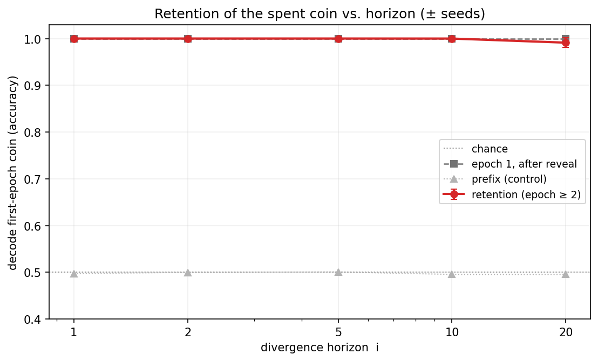
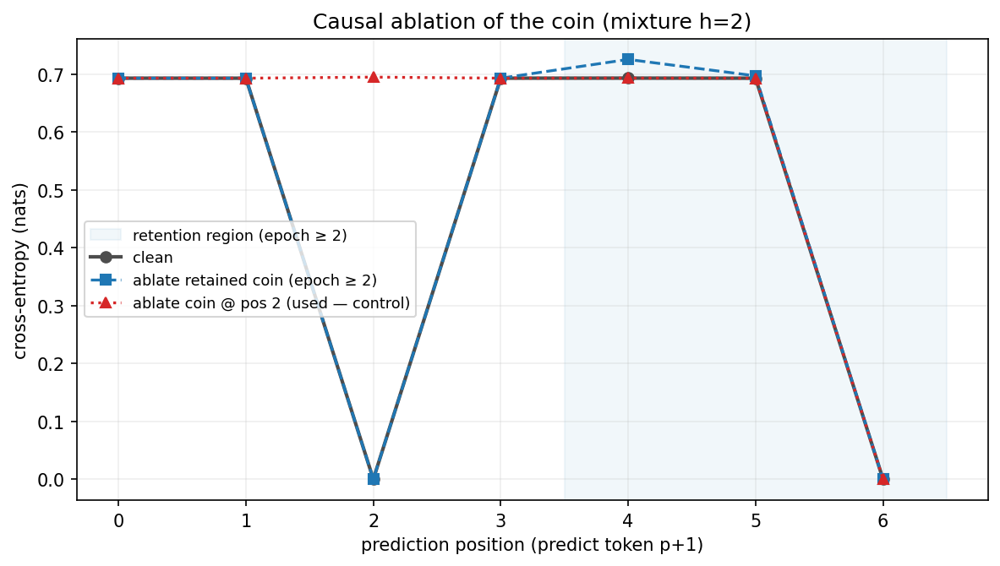
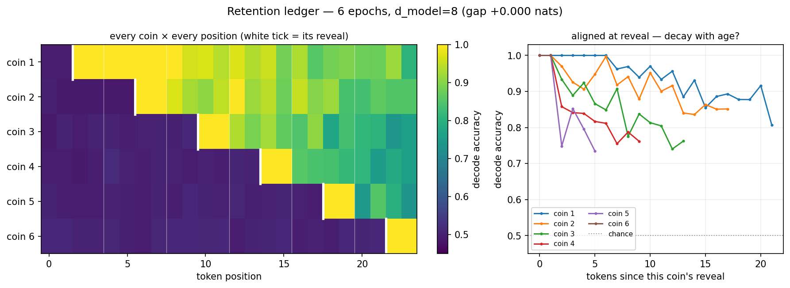

# Super-Sufficiency: Transformers Retain Belief States They No Longer Need

*A from-scratch replication of [Shai et al. (2024)](https://arxiv.org/abs/2405.15943),
extended with a mixture-process experiment on what the residual stream keeps — and when
it forgets. Code, tests, and figures: [github.com/LGOICOUR/belief-state-geometry](https://github.com/LGOICOUR/belief-state-geometry).*

## TL;DR

- I replicate the belief-state-geometry result: a small transformer trained *only* on
  next-token prediction over a known HMM linearly represents the optimal Bayesian belief
  over the generator's hidden states, in the geometry predicted in advance (for Mess3, a
  fractal; R² ≈ 0.99 from the final residual stream).
- I then ask whether the residual holds *only* the minimal sufficient statistic for
  prediction, or more. Using **mixture processes** — a hidden "coin" picks one of two
  generators that are predictively identical for a tunable horizon, then diverge — I find
  the model is **super-sufficient**: it keeps the coin's identity decodable at ~100% long
  after it becomes predictively irrelevant, where the optimal (minimal) belief has already
  discarded it.
- A **causal ablation** shows the retained information is **inert**: removing it changes no
  prediction, while removing the *same* information where it is genuinely used breaks the
  prediction. So it is vestigial memory, not silent computation.
- The retention is **load-dependent**. A full-width model holds a *ledger* of many spent
  coins simultaneously; a bandwidth-starved model sheds the **oldest** first while
  protecting the live one — an empirical traversal of the predictive rate–distortion
  trade-off.
- The same signature — task-irrelevant latents retained, decodable-but-degraded, gated by
  load — is a documented property of **working memory** in the brain. The method (define a
  latent with ground truth, decode it from population activity, lesion it) is the
  systems-neuroscience paradigm. That bridge is why I built this.

A note on register: none of the individual phenomena below is, on its own, surprising. The
contribution is a *clean, ground-truthed, causally-verified, load-resolved* characterization
of one of them in a setting where the optimal representation is computable in closed form.

## Background: belief-state geometry (replication)

Computational mechanics gives a sharp answer to "what must an optimal predictor represent?"
To predict a process as well as possible, a system must track the **minimal sufficient
statistic of the past for the future** — the *belief state* (a distribution over the
generator's hidden states), whose equivalence classes are the *causal states*. Shai et al.
showed that a transformer trained on next-token prediction over a known HMM linearly
encodes this belief state in its residual stream, in the geometry derived from the process
alone — before looking at the network.

I reproduce this from scratch. For the **Mess3** process the reachable belief states form a
fractal in the 2-simplex; a single linear probe recovers it from the 64-dimensional
final-layer residual at **R² ≈ 0.99**, and the recovered cloud matches the analytic fractal:

For **RRXOR** I reproduce the two secondary results: the belief is **distributed across
layers** (recovery from the concatenation of all layers, R² ≈ 0.82, beats any single layer,
≈ 0.61), and the residual encodes the belief far better than the next-token distribution can
(0.82 vs 0.27) — i.e. it carries information about the *whole future*, not just the token
the model was trained on. Training loss sits at the analytic entropy-rate floor throughout,
which is the precondition that makes the representational claim non-vacuous: an optimal
predictor *must* carry the sufficient statistic.

## The question: only the minimal sufficient statistic, or more?

The belief state is *minimal* by definition — it keeps everything relevant to the future and
nothing else. So a natural test of how literally to read "the transformer represents the
belief geometry" is: does the residual hold **only** that, or does it carry extra,
predictively-irrelevant information? An optimal predictor has no reason to; a real network
trained with plain cross-entropy has no term that forbids it.

## Setup: mixture processes with a tunable divergence horizon

I build a process where this question has a crisp, ground-truthed answer. Each **epoch**, a
fair hidden coin `Z ∈ {A, B}` selects one of two sub-generators. The two are
**statistically identical for the first `i` steps** (a shared random prefix) and then
**diverge** (a short `Z`-indicator tail). `Z` is resampled every epoch. Because the
sub-generators agree for `i` steps, `Z` is unidentifiable until the divergence; because it
is resampled, once an epoch ends `Z` becomes **predictively defunct** — nothing in the
future depends on it. The horizon `i` is a dial.

This is just another `Process` in the same framework, and "which generator is active" is
just a marginal of the belief — so the entire Phase-1 toolkit (analytic beliefs, linear
probes, the loss floor) applies unchanged. I decode `Z` by position from the residual stream.

## Result 1 — super-sufficiency

Within an epoch the model behaves as theory demands: `Z` is at chance before the divergence
and commits to ~1.0 exactly at the horizon. The interesting part is the **next** epoch.
Once an epoch ends, the optimal belief about the just-finished coin is `½` (it is
independent of everything that follows). Yet the model keeps the old coin **linearly
decodable at ~100%** well into the following epoch, where the current tokens are provably
independent of it. The residual state is therefore **finer-grained than the causal state**:
it preserves a distinction the minimal sufficient statistic discards.

This is robust. Across horizons `i ∈ {1, 2, 5, 10, 20}` and three seeds each — every model
trained to the loss floor — retention is ≈ 1.0 (1.00 for `i ≤ 10`, 0.99 at `i = 20`), and
the decodability onset tracks the horizon exactly:

I call this **super-sufficiency**: the residual carries the belief state *plus*
predictively-irrelevant memory. (Mechanistically the retention is unsurprising — the old
indicator tokens are still in the context window, so attention can re-derive `Z`; nothing in
the loss pushes it to stop. The point is not that it's mysterious, but that it is a clean,
measurable deviation from minimality, with a knob.)

## Result 2 — the retained information is causally inert

Decodability is not use: a linear probe can read information the model's computation ignores.
So I run a directional **ablation** (a lightweight version of the amnesic-probing /
concept-erasure technique): project the coin's direction out of the residual at the
epoch-where-it-is-defunct, and measure next-token loss. Two conditions, with the second as a
positive control:

- **Ablate the defunct coin** (epoch ≥ 2): its decodability collapses 1.0 → 0.50, yet
  next-token loss is **unchanged** (max Δ ≈ 0.03 nats).
- **Ablate the same coin where it is used** (at the reveal, to predict the next indicator):
  that prediction's loss **spikes** 0.0 → 0.69 nats.

So the retained copy is decodable *and demonstrably unused* — vestigial memory, not silent
computation. The control matters: without it, "ablating it does nothing" could just mean a
weak knife.

## Result 3 — forgetting is load-dependent

Does the model ever *become* minimal? Shrinking the residual width alone does not induce
forgetting: at every width that still learns the task, the single defunct coin stays decoded
at ~1.0 (it remains re-readable from context). But that test has only one cheap coin in a
two-epoch window. So I extend the context to **six epochs** and decode *every* coin at every
position — a retention *ledger* — at two widths.

At full width the model holds a near-complete ledger: all five past coins decodable
(0.82–1.0), plus the live one at 1.0. At `d_model = 8`, the same model — still trained to the
loss floor — **sheds the oldest coins first** (the reveal-aligned curves slope down with
age) while keeping the live coin at 1.0:

This is the first forgetting I see anywhere in the project, and it is induced by
representational **load × age**, not width alone. It is exactly what **predictive
rate–distortion** ([Marzen & Crutchfield](https://arxiv.org/abs/1412.2859) — and Marzen is a
co-author of the original belief-state paper) predicts: *under resource constraints, the
optimal lossy representation is the minimal sufficient statistic.* Full capacity → keep
everything reachable (super-sufficient); scarce capacity under load → move toward minimality,
discarding the most useless (oldest) information first. The model is shedding precisely what
the rate–distortion bound says it should.

(A small flanking check: belief content is *directional*, and so is its uncertainty — the
residual's **norm** does not track belief entropy. On RRXOR, which dissociates belief- from
output-entropy, the final-layer norm follows *output* entropy (ρ up to ~0.9) while
belief-entropy correlation is ≈ 0 at every layer — consistent with LayerNorm discarding
scale.)

## Limitations and the next experiment

- **Toy process, known generator.** This is a proof-of-principle in a setting where the
  optimal representation is computable; it is not yet a claim about frontier LMs.
- **In-context reachability is a confound for "memory."** Because the spent coin's tokens
  stay in the context window, this is not a true memory bottleneck — the model forgets under
  *load*, not because the information became inaccessible. The clean isolation of the
  optimal-prediction minimality question is the **headline next experiment**: push the latent
  out of the context window, or move to a recurrent / state-space model where state must be
  *carried*, and ask whether an optimal predictor then compresses the spent coin away. The
  ledger forgets via load; a bottleneck would force it via inaccessibility.
- **Scale.** Small models on toy data; everything runs on a laptop. The probes are linear and
  evaluated on held-out data, but a single architecture.

## Reproducibility

Everything is from scratch (NumPy + PyTorch + TransformerLens), tested (the HMMs, beliefs,
and the analytic predictions are unit-tested), and reproducible on CPU or a consumer GPU —
the tiny checkpoints are committed so the figures regenerate without retraining. Method and
caveats: [`docs/phase2.md`](phase2.md). Repo:
[github.com/LGOICOUR/belief-state-geometry](https://github.com/LGOICOUR/belief-state-geometry).

*Thanks to the authors of the original belief-state paper — reconstructing it from the
Mixed-State Presentation up was the most I've learned from a paper in a long time.*
